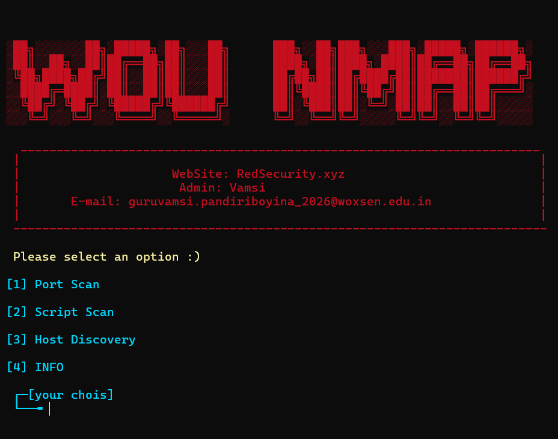

# WOU-NMAP

This tool makes using nmap easier

## ScreenShot



## installation

Just run the following commands to install

```
git clone https://github.com/Rock0007/Easy-nmap.git
cd easy-nmap
bash installer.sh
```

## Usage

Just run the following command

```
WOU-NMAP
```

You can run the above command anywhere in terminal

## Contact us

WebSite: https://redsecurity.xyz<br/>Email: guruvamsi.pandiriboyina_2026@woxsen.edu.in
